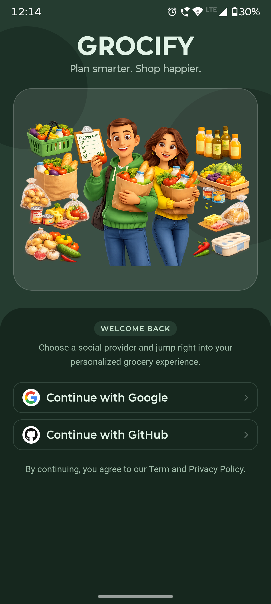
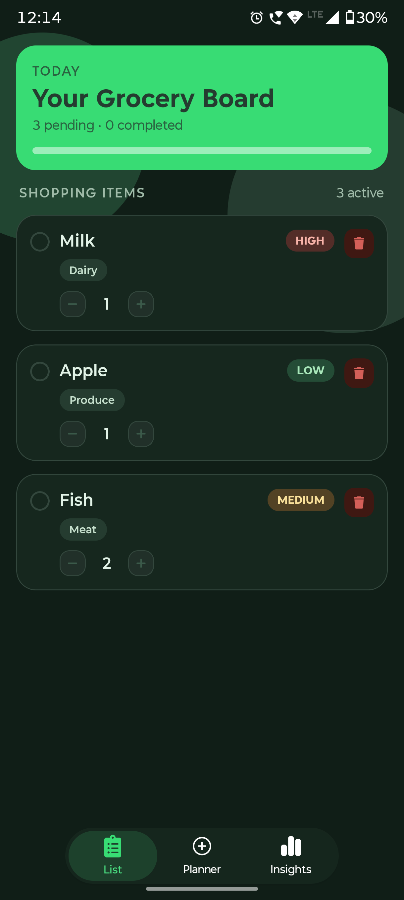
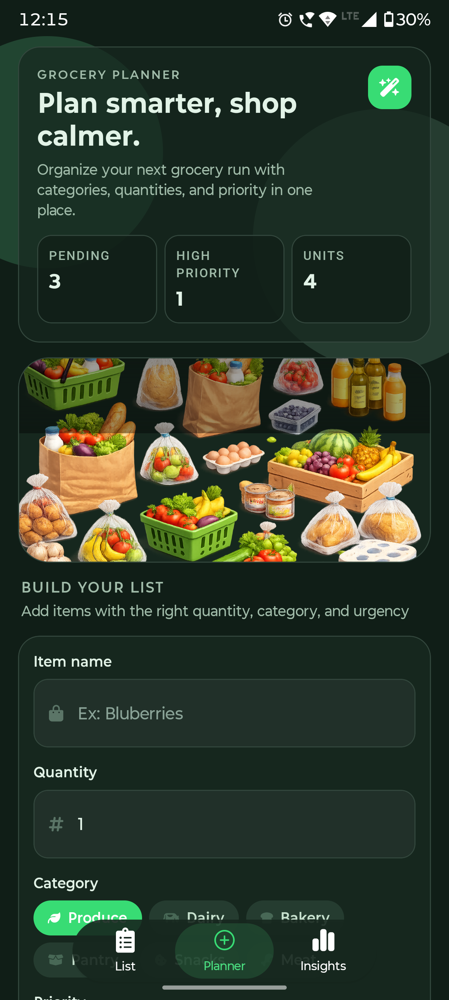
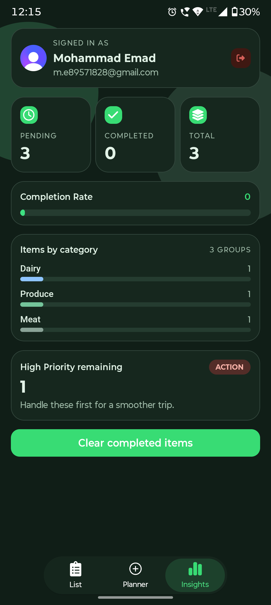

# Grocify 🛒
### Plan smarter, shop calmer.

Grocify is a modern, high-performance grocery management application built with Expo and React Native. It helps users organize their shopping lists, gain insights into their spending habits, and plan their grocery runs with ease.

---

## 📱 App Screens

<p align="center">
  
  
  
  
</p>

---

## ✨ Key Features

- **✅ Smart Shopping List**: Real-time management of pending and completed grocery items. Stay organized while you shop.
- **📊 Detailed Insights**: Visual analytics to track your spending habits, most purchased categories, and priority levels.
- **📝 Grocery Planner**: Effortlessly plan your next run by adding items with specific quantities, categories, and priority (Low, Medium, High).
- **🔐 Secure Authentication**: Integrated with **Clerk** for robust, hassle-free authentication including SSO/Google support.
- **☁️ Cloud Sync**: Powered by **Drizzle ORM** and **Neon (PostgreSQL)**, ensuring your data is always safe and synced across devices.
- **🎨 Premium UI/UX**: A clean, modern interface styled with **NativeWind** (Tailwind CSS) for a smooth and responsive experience.

---

## 🛠️ Tech Stack

- **Framework**: [Expo](https://expo.dev/) (React Native)
- **Styling**: [NativeWind](https://www.nativewind.dev/) (Tailwind CSS)
- **Authentication**: [Clerk](https://clerk.com/)
- **Database**: [Drizzle ORM](https://orm.drizzle.team/) with [Neon](https://neon.tech/) (PostgreSQL)
- **State Management**: [Zustand](https://github.com/pmndrs/zustand)
- **Animations**: [React Native Reanimated](https://docs.swmansion.com/react-native-reanimated/)
- **Icons**: [Expo Vector Icons](https://docs.expo.dev/guides/icons/)

---

## 🚀 Getting Started

### Prerequisites

- [Node.js](https://nodejs.org/) (LTS)
- npm or yarn
- [Expo Go](https://expo.dev/go) app (for mobile testing)

### Installation

1. **Clone the repository:**
   ```bash
   git clone https://github.com/yourusername/grocify.git
   cd grocify
   ```

2. **Install dependencies:**
   ```bash
   npm install
   ```

3. **Configure Environment Variables:**
   Create a `.env` file in the root directory and add your Clerk and Neon DB credentials (refer to `.env.example` if available).

4. **Run the application:**
   ```bash
   npx expo start
   ```

---

## 📂 Project Structure

- `app/`: Expo Router file-based navigation.
  - `(auth)/`: Authentication screens (Sign-in, SSO).
  - `(tabs)/`: Main application tabs (Shopping List, Insights, Planner).
- `components/`: Reusable UI components organized by feature.
- `store/`: Zustand state management (Grocery Store).
- `lib/`: Database configuration and schema definitions.
- `assets/`: Media files including icons and screenshots.
- `hooks/`: Custom React hooks for application logic.

---

## 🤝 Contributing

Contributions are welcome! Please feel free to submit a Pull Request.

## 📄 License

This project is licensed under the MIT License - see the [LICENSE](LICENSE) file for details.
